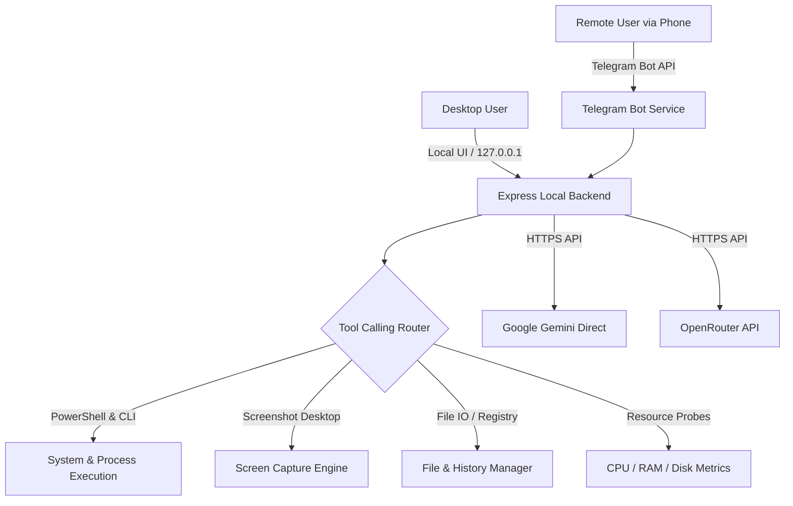

# 🚀 TRIQ BOT — Windows AI PC Assistant & Remote Controller

<p align="center">
  
</p>

<p align="center">
  <strong>An ultra-fast, local-first PC assistant and remote controller powered by Google Gemini & OpenRouter LLMs.</strong><br>
  <em>Manage, automate, inspect, and interact with your Windows PC seamlessly from a desktop Command Center or anywhere on the go via Telegram.</em>
</p>

<p align="center">
  
  
  
  
  
</p>

---

## ⚡ What is TRIQ BOT?

**TRIQ BOT** is a private, lightweight, and token-efficient desktop assistant built by **Mistecx**. It transforms natural conversational prompts into safe, structured system operations on your Windows machine using native LLM tool calling.

Whether you're sitting in front of your desktop using the glassmorphic Command Center or away from home messaging your private Telegram bot, TRIQ BOT executes tasks on demand with zero latency and complete privacy.

---

## 🌟 Core Highlights

### 🖥️ Native Windows Command & Control
- **PowerShell & CLI Execution**: Execute scripts, launch installed apps, inspect network status, manage processes, and handle administrative commands.
- **File System Management**: Read, write, search, transfer, and download files directly via chat or Telegram.
- **Live Desktop Snapshots**: Snap real-time desktop screenshots on demand and preview them directly in chat or receive high-res images in Telegram.
- **System Metrics Monitoring**: Live tracking of CPU load, RAM usage, and multi-disk partition capacities with zero layout-reflow performance.

### 📱 Secure Telegram Remote Gateway
- **Remote On-The-Go Control**: Message your bot from anywhere to run commands, check PC health, lock the workstation, or fetch documents.
- **Single-User Lock Security**: Strict authorization whitelist (`TELEGRAM_AUTHORIZED_USER_ID`) rejects unauthorized access attempts automatically.
- **Bi-directional File Transfers**: Send files to your PC or receive files generated on your computer directly in your Telegram chat.

### 🧠 Dual AI Engine Architecture
- **Google Gemini Direct**: Native high-speed function calling with `gemini-2.0-flash` or `gemini-2.5-flash` via Google AI Studio.
- **OpenRouter Multi-Model Gateway**: Connect to hundreds of open/closed models (Claude, Llama 3.1, Mistral, Qwen, DeepSeek, Nemotron).
- **Auto-Route Free Models**: Smart fallback toggle to route queries to verified free-tier models on OpenRouter to save API costs.
- **Custom System Instructions**: Inject custom personas, operational rules, or output formatting guidelines.

### 💎 Ultra-Smooth Glassmorphic Command Center
- **Performance Optimized**: GPU-composited tab transitions (`visibility: hidden` / `opacity`) with zero layout reflows and low-power background idling.
- **Interactive Execution Trace**: Expandable real-time trace log of CLI operations, function parameters, and status codes executed by the agent.
- **Adaptive Background Polling**: Automatic throttle & pause when minimized to system tray or running in the background.

### 🪟 Windows Integration & Background Silent Mode
- **System Tray Resident**: Starts cleanly in the Windows notification area tray with quick right-click controls.
- **Single-Instance Protection**: Prevents duplicate background processes when double-clicking desktop shortcuts.
- **Silent Boot Option**: One-click **Startup: ON / OFF** sidebar button to launch automatically on Windows boot silently without popping up on screen.

---

## 📸 Architecture & Design



---

## 🛠️ Quick Installation & Setup

### Option 1: Direct Windows Installer (`.exe`)
Download the pre-compiled installer from releases or the `dist/` directory:
- Run `TRIQ BOT Setup 1.0.0.exe`
- Choose installation path and finish setup
- Launch **TRIQ BOT** from your Desktop or Start Menu!

---

### Option 2: Run from Source

#### 1. Prerequisites
- **Node.js** (v18.0.0 or higher)
- **npm** (comes with Node.js)
- Windows 10 or Windows 11

#### 2. Clone the Repository
```bash
git clone https://github.com/LostxJayesh/TRIQBOT.git
cd TRIQBOT
```

#### 3. Install Dependencies
```bash
npm install
```

#### 4. Configure Environment
Create a `.env` file or adjust `config.json` (also configurable via the in-app Settings UI):
```ini
PORT=3000
PROVIDER=gemini
GEMINI_API_KEY=AIzaSy...
GEMINI_MODEL=gemini-2.0-flash
TELEGRAM_BOT_TOKEN=123456789:ABC...
TELEGRAM_AUTHORIZED_USER_ID=987654321
START_ON_BOOT=false
```

#### 5. Launch
```bash
# Launch full Electron Desktop Application
npm run electron

# Or start standalone local web server
npm start
```
*Access the web dashboard at `http://127.0.0.1:3000`.*

---

## 📦 Building the Installer

To package the application into a standalone Windows NSIS installer or portable executable:

```bash
# Build NSIS Setup Installer (outputs to dist/TRIQ BOT Setup 1.0.0.exe)
npm run build

# Build Portable Executable
npm run build:portable

# Build Both
npm run build:all
```

---

## 🎮 Telegram Remote Commands

| Command / Message | Action |
|---|---|
| `What is my CPU and RAM load?` | Queries hardware counters and returns formatted usage stats. |
| `Take a screenshot` | Captures current desktop screen and sends the photo to Telegram. |
| `Open Notepad and write hello` | Launches application and performs automated tasks. |
| `Run ipconfig /all` | Runs PowerShell command safely and streams output back. |
| `List files in C:\Downloads` | Lists directory contents with file sizes and dates. |
| `/status` | Direct hardware and uptime health check. |
| `/clear` | Clears conversation memory and resets session context. |

---

## 🔒 Security & Privacy Architecture

- **100% Localhost Bound**: The internal Express server binds exclusively to `127.0.0.1` — no public ports are opened.
- **Zero Third-Party Telemetry**: Your prompts, traces, and files stay strictly between your computer, your private Telegram bot, and your selected AI provider.
- **Encrypted Local Storage**: API credentials and bot tokens are stored locally on your machine in `config.json` or `.env`.
- **Single-User Lockout**: Any unauthorized Telegram user attempting to interact with your bot is immediately blocked and logged.

---

## 👨‍💻 Developer & Company

Built with ❤️ by **Mistecx**

- 👨‍💻 **Creator**: **Jayesh**
- 🌐 **Portfolio**: [lostxjayesh.netlify.app](https://lostxjayesh.netlify.app/)
- 🐙 **GitHub**: [@LostxJayesh](https://github.com/LostxJayesh)
- 📸 **Instagram**: [@lostxjayesh](https://www.instagram.com/lostxjayesh)
- 🐦 **Twitter / X**: [@jayesh__6z](https://x.com/jayesh__6z)
- 💬 **Discord**: [Join Community](https://discord.gg/bMrmBdctB)

---

## 📄 License & Disclaimer

Distributed under the MIT License. See `LICENSE` for details.

*Disclaimer: TRIQ BOT executes native commands on your operating system based on LLM reasoning. Always verify system instructions and maintain active backups of critical data.*
